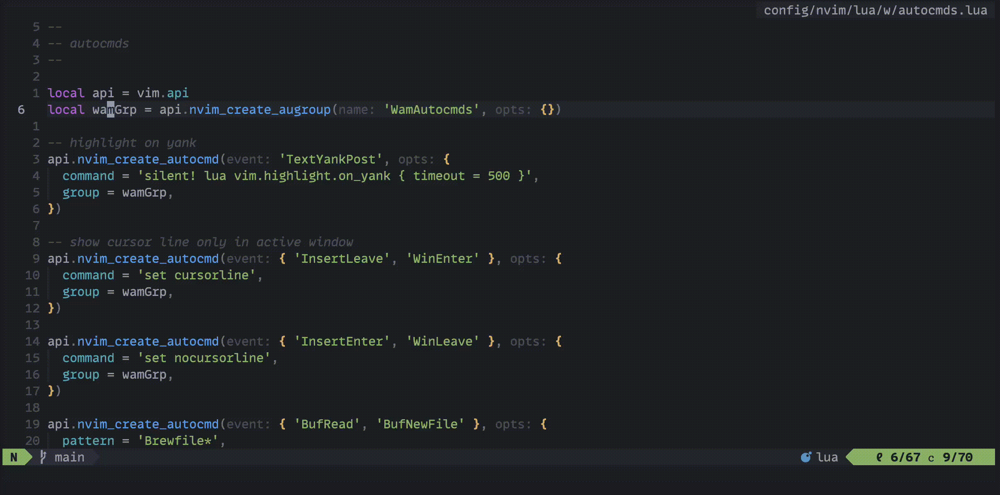

# scalpel.nvim

**scalpel.nvim** is a Neovim plugin designed to expedite your find/replace workflow within a buffer. It sets up Neovim's native [`substitution`](https://neovim.io/doc/user/usr_10.html#10.2) command, automating some steps to eliminate some typing.



[](https://github.com/wassimk/scalpel.nvim/actions/workflows/build.yml) 

## Installation

Install **scalpel.nvim** with your preferred plugin manager. 

The following example shows the installation process using [lazy.nvim](https://github.com/folke/lazy.nvim). It sets the scalpel substitute keymap to `<leader>e`.

```lua
{
  'wassimk/scalpel.nvim',
  version = "*",
  config = true,
  keys = {
    {
      '<leader>e',
      function()
        require('scalpel').substitute()
      end,
      mode = { 'n', 'x' },
      desc = 'substitute word(s)',
    },
  },
}
```

> [!NOTE]
> You can set the keymap to anything you wish.

## Usage

#### Normal Mode

1. Move the cursor over the word to replace
2. Trigger the substitution with your keymap
3. Begin typing the desired substitution and hit return

#### Visual Mode

1. Use visual mode (`v`) to select the word(s) to replace within a *single line*
2. Trigger the substitution with your keymap
3. Begin typing the desired substitution and hit return

#### Visual Line Mode

1. Highlight word(s) to substitute with `*` or `/`
2. Use visual line mode (`V`) to highlight the lines with the word(s) to substitute
3. Trigger the substitution with your keymap
4. Begin typing the desired substitution and hit return

> [!TIP]
> The word(s) being replaced during substitution are available in the replacement text using `&`.
> 
## Acknowledgments

This project was inspired by [Scalpel](https://github.com/wincent/scalpel), a Vimscript plugin I've used for many years. **scalpel.nvim** is my version, which was reimagined and implemented in Lua for fun.
